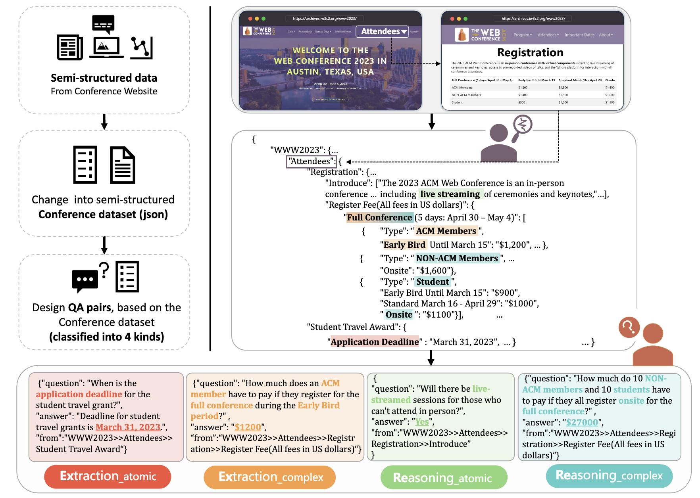
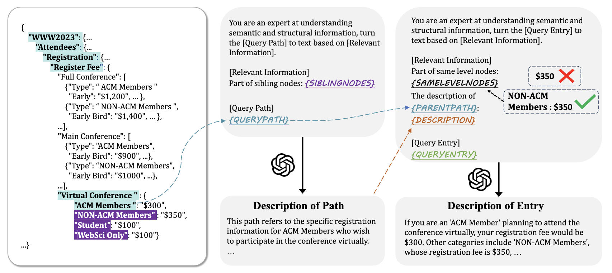

# ConferenceQA

ConferenceQA是一个为学术会议问答任务而构建的数据集，它包含了7个不同会议信息并以半结构化的JSON格式组织，每个会议配有近100个人工注释的问答对，每个问答对根据回答的类型分成了四类。此数据集的目的是为了增强大型语言模型处理学术会议相关查询的能力，尤其是在知识准确性方面，以便研究人员和开发者更好地在这个方向上进行研究。具体可阅读我们的论文[Reliable Academic Conference Question Answering: A Study Based on Large Language Model](https://arxiv.org/abs/2310.13028)。

## 数据集的收集方法

<p align="center">
    <a href="https://github.com/zjukg/ConferenceQA/tree/main"> </a>
<p>

### 构建半结构化数据
为了构建ConferenceQA数据集，我们采取了手动和自动化的方法，将官方学术会议网站上的数据转换为半结构化的JSON格式。每个页面的标题作为JSON数据中的键或值的一部分，形成一种树状结构，以反映页面间的嵌套和并行关系。对于页面上的非结构化内容，如纯文本和小标题，我们将小标题作为路径提取，并将对应的内容作为值；同时为了增加粒度多样性，我们还对纯文本进行了更细致的分割。会议中结构化内容，如表格信息，我们通过网络爬虫获取并转换为对应页面路径下的半结构化数据。这样，我们最终得到了7个以半结构化JSON形式组织的会议数据集，它们可以作为准确可靠的知识库使用。

### 构建问答对
在创建ConferenceQA数据集的问答对时，我们结合了人工和自动化的方法，以确保每个问题都能反映人们在现实场景中可能提出的疑问。我们首先利用ChatGPT生成20个虚构研究人员的人物画像，包括年龄、研究方向、职位、历史发表论文和会议参与经验等细节。然后，使用prompt让ChatGPT代入每个角色并就每个会议提出五个不同粒度的问题，覆盖不同背景的角色对会议的兴趣或不确定性。最后，通过手动审核过滤重复或过于复杂的问题，并添加更具广泛性和多样性的问题。接着，我们根据半结构化的JSON数据手动标注答案，并为问答对中的每个答案注明来源，即答案在学术会议JSON数据中的位置，以确保数据集的可靠性。

### 问答对分类
为了评估模型回答不同难度问题的能力，我们设计了一个分类方案来区分问答对。这个分类主要基于两个方面：生成答案的过程以及生成正确答案所涉及的条目数量。

第一个维度是"extraction"或"reasoning"，它考虑生成答案的过程。
- extraction：答案可以直接从数据集中提取，即答案是数据集中的文本片段；
- reasoning：模型需要先进行推理然后生成答案，即相应答案不是数据集中的文本。

第二个维度是"atomic"或"complex"，主要考虑生成正确答案所涉及的条目数量。
- atomic：答案的生成仅需要来自单个条目的信息；
- complex： 答案的生成需要多个条目的信息

以上两个维度结合形成从简单到困难的四个类别：extraction atomic、extraction complex、reasoning atomic、reasoning complex。这一分类用于测试模型在不同复杂度和推理要求下的问答能力。

## 数据内容

下面是WWW2023的json数据的部分内容：

```json
{
    "WWW2023": {
        "Home": {
            "name": "WWW2023",
            "date": "APRIL 30 - MAY 4, 2023",
            "location": "Austin, Texas, US. AT&T Hotel and Conference Center at The University of Texas at Austin",
            "full name": "The Web Conference",
            "introduction": "Since the invention of the World Wide Web in 1989, The Web Conference (formerly known as International World Wide Web Conference, abbreviated as WWW) is a yearly international academic conference on the topic of the future direction of the World Wide Web. This conference has been the premier venue to present and discuss progress in research, development, standards, and applications of the topics related to the Web. Over the past three decades, The Web Conference has been the forum where some of the most fundamental Web technologies have been introduced, such as the Anatomy of a Large Scale Web Search Engine in 1998 prefiguring Google, the EigenTrust algorithm in 2003 and the YAGO knowledge base in 2007 (see also the Test of Time Award past recipients). The conference assembles scholars, researchers, policymakers, practitioners, and end-users with one unifying goal: to envision and create the future of the Web.",
            "ACM A.M. Turing Award Lecture": {
                "name": "Bob Metcalfe",
                "affiliation": "MIT"
            },
            "keynotes": [
                {
                    "name": "Barbara Poblete",
                    "affiliation": "University of Chile and Amazon Visiting Academic"
                },
                {
                    "name": "David Rand",
                    "affiliation": "MIT"
                },
                {
                    "name": "Payal Arora",
                    "affiliation": "Erasmus University Rotterdam"
                },
                {
                    "name": "Zachary Elkins",
                    "affiliation": "UT Austin"
                },
                {
                    "name": "Michalis Vazirgiannis",
                    "affiliation": "LIX, Ecole Polytechnique"
                }
            ],
          "..."
        },
      "..."
    },
  "..."
}
```

下面是其对应的一个QA pair，以及答案在json中的路径：
```json
{
    "question": "What is the date of the WWW2023 conference?", 
    "answer": "From April 30, 2023 to May 4, 2023.",
    "from": "WWW2023/Home/date"
},
```
## 结构感知方法

我们设计了一种融合结构信息和语言信息的方法，以更好地处理学术会议问答任务。主要方法是利用gpt生成文本描述，并针对生成的文本描述进行不同的组合设计，下面是这个方法的示例图，具体方法和实验结果可阅读我们的[论文](https://arxiv.org/abs/2310.13028)：

<p align="center">
    <a href="https://github.com/zjukg/ConferenceQA/tree/main"> </a>
<p>
## 使用方法

### 安装依赖

要安装项目的依赖，你需要使用以下步骤：

1. **下载项目代码：** 打开终端并导航到你想要保存项目的目录。然后使用Git克隆项目的仓库。

    ```bash
    git clone https://github.com/zjukg/ConferenceQA.git
    ```

2. **安装依赖：** 进入项目目录并使用pip安装requirements.txt文件中列出的依赖项。

    ```bash
    cd your_repository
    pip install -r requirements.txt
    ```

### 修改openai api key 

进入utils/gpt.py文件中，在下面这个函数下面对应位置填上两个api key
```python
def get_api_key(idx: int = 0):
    if idx == 0:
        # your openai api key, for text-embedding-ada-002
        pass 
    elif idx == 1:
        # your openai api key, for gpt
        pass
```


## 文件结构

```
ConferenceQA/
│
├── dataset/                                  # 数据目录
│   └── WWW                                   # WWW2023数据集
│       ├── WWW2023.json                      # WWW2023 json数据
│       ├── extraction_atomic.json            # EA类型QA
│       ├── extraction_complex.json           # EC类型QA
│       ├── reasoning_atomic.json             # RA类型QA
│       └── reasoning_complex.json            # RC类型QA
│   ...                                       # 其他会议数据
│
├── utils/                                    # 工具函数目录
│   ├── api_request_parallel_processor.py     # 多协程调用api
│   ├── cal_sim.py                            # 计算相似度
│   ├── gpt.py                                # 调用gpt接口
│   ├── logging.py                            # 输出日志信息
│   └── cluster.py                            # 聚类
│
├── figures/                                  # 图片目录
│
├── conferenceqa.py                           # 数据预处理
├── encoder.py                                # 编码器
├── get_bm25.py                               # BM25结果
├── eval_bm25.py                              # 测试BM25结果
├── get_origin.py                             # 获得原始输出
├── evaluate.py                               # 测试模块
├── retrieve.py                               # 检索模块
├── main.py                                   # 主函数入口
│
└── requirements.txt                          # 项目依赖文件
```

## 联系方式
如果有问题，请通过以下方式联系项目维护者：

邮箱: huangzww@zju.edu.cn

## 论文引用

我们欢迎其他研究者引用我们的论文，并请在引用时包含完整的引用信息：
```bibtex
@article{huang2023reliable,
  title={Reliable Academic Conference Question Answering: A Study Based on Large Language Model},
  author={Huang, Zhiwei and Jin, Long and Wang, Junjie and Tu, Mingchen and Hua, Yin and Liu, Zhiqiang and Meng, Jiawei and Chen, Huajun and Zhang, Wen},
  journal={arXiv preprint arXiv:2310.13028},
  year={2023}
}
